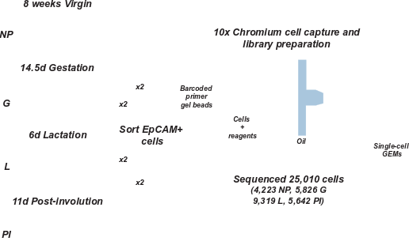

# \src
# Differentiation dynamics of the developing mammary gland revealed by single-cell RNA-sequencing
## Abstract
Characterising the hierarchy of mammary epithelial cells (MECs) and how they are regulated
during adult development is important for understanding how breast cancer arises. Here we
report the use of single-cell RNA sequencing to determine the gene expression profile of
MECs across four developmental stages; nulliparous, mid gestation, lactation and post
involution. Our analysis of 23,184 cells identifies 15 clusters, few of which could be fully
characterised by a single marker gene. We argue instead that the epithelial cells—especially
in the luminal compartment—should rather be conceptualised as being part of a continuous
spectrum of differentiation. Furthermore, our data support the existence of a common luminal
progenitor cell giving rise to intermediate, restricted alveolar and hormone-sensing pro-
genitors. This luminal progenitor compartment undergoes transcriptional changes in
response to a full pregnancy, lactation and involution. In summary, our results provide a
global, unbiased view of adult mammary gland development.

This folder contains all scripts that were used in the analysis. 
Apart from the scripts that were used for each figure, the folder contains the following general scripts:

- [functions.R](functions.R) contains general functions that were used in the analysis
- [getTFcheckpoint.R](getTFcheckpoint.R) and [PrepareData.R](PrepareData.R) were used to convert the Cell Ranger output into an R object
- [QCAnalysis.R](QCAnalysis.R), [Clustering.R](Clustering.R) and [ClusterBootstrap.R](ClusterBootstrap.R) (in this sequence) **need to be run before any of the figure scripts** as they produce necessary intermediate data
- [DEAnalysis.R](DEAnalysis.R) computes differential expression between all clusters for Supplementary Table 1
